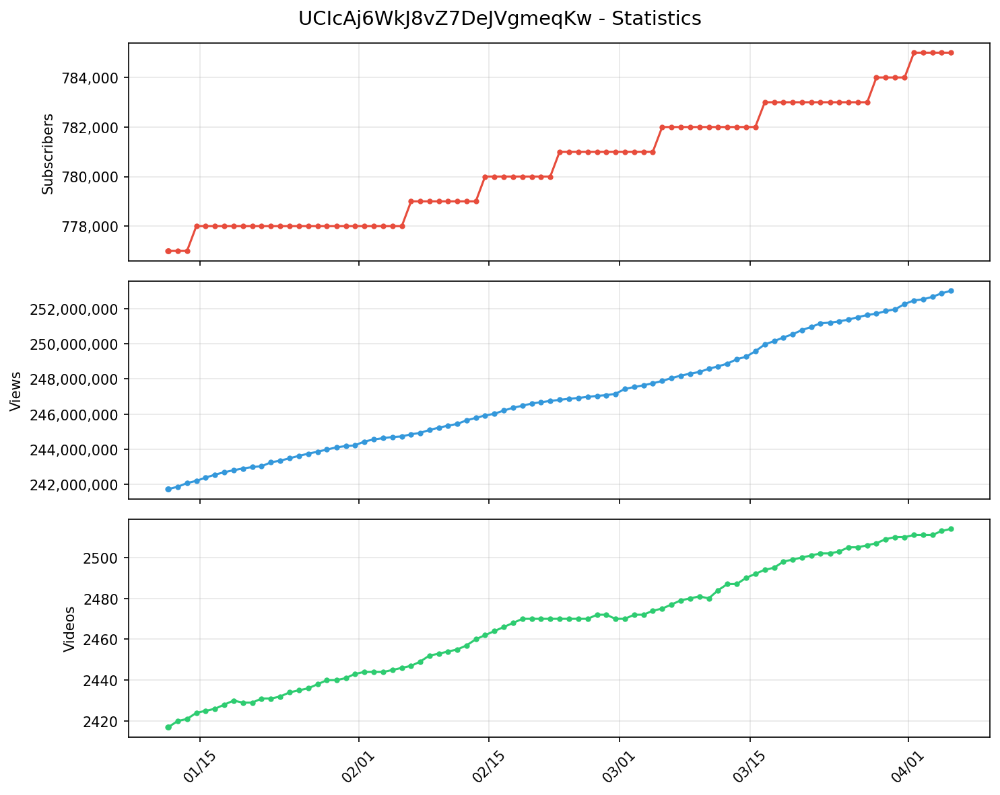

# YouTube Channel Tracker

> Note: 
> このツールは Claude (Anthropic) によって生成された.

YouTubeチャンネルの統計情報を毎日自動で記録するツール.

## 統計グラフ



※ データが2件以上蓄積されると自動でグラフが表示される.

## 機能

- 指定したYouTubeチャンネルの統計情報を取得
  - 登録者数
  - 総視聴回数
  - 動画数
- GitHub Actionsによる毎日の自動実行 (日本時間 21:00)
- CSVファイルへのデータ蓄積

## セットアップ

### 1. YouTube Data API キーの取得

1. [Google Cloud Console](https://console.cloud.google.com/) にアクセス
2. プロジェクトを作成または選択
3. 「APIとサービス」→「ライブラリ」から「YouTube Data API v3」を有効化
4. 「APIとサービス」→「認証情報」からAPIキーを作成

### 2. GitHub Secretsの設定

リポジトリの Settings → Secrets and variables → Actions から以下を追加:

- `YOUTUBE_API_KEY`: 取得したAPIキー

### 3. チャンネル設定

`config/channels.json` に追跡したいチャンネルを設定する.
```json
{
  "channels": [
    {
      "handle": "@example",
      "name": "チャンネル名",
      "note": "メモ"
    }
  ]
}
```

## ファイル構成
```
YouTube_Channel_Tracker/
├── .github/
│   └── workflows/
│       └── fetch_stats.yml
├── src/
│   └── fetch_stats.py
├── config/
│   └── channels.json
├── data/
│   └── (自動生成されるCSVファイル)
├── pyproject.toml
├── .gitignore
└── README.md
```

## ローカルでの実行
```bash
# 環境変数の設定 (Windows)
set YOUTUBE_API_KEY=your_api_key_here

# 実行
uv run python src/fetch_stats.py
```

## ライセンス

MIT License